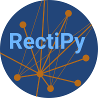

# RectiPy

[](https://github.com/pyrates-neuroscience/RectiPy)
[](https://badge.fury.io/py/rectipy)
[](https://badge.fury.io/py/rectipy)
[](https://circleci.com/gh/pyrates-neuroscience/RectiPy)
[](https://rectipy.readthedocs.io/en/latest/?badge=latest)
[](https://zenodo.org/badge/latestdoi/523464500)



**Rec**urrent neural network **t**raining **i**n **Py**thon (`RectiPy`) is a software package developed by Richard Gast 
that allows for lightweight implementations of recurrent neural networks (RNNs) based on ordinary or delayed 
differential equations.
`RectiPy` provides an intuitive `YAML` interface for model definition, and leverages [PyRates](https://github.com/pyrates-neuroscience/PyRates)
to translate these model definitions into `PyTorch` functions.
This way, users can easily define their own neuron models, spike-based or rate-based, and use them to create a RNN model.
All model training, testing, as well as numerical integration of the differential equations is also performed in `PyTorch`.
Thus, `RectiPy` comes with all the gradient-based optimization and parallelization features that `PyTorch` provides.

## Basic Features

### 1. Model definition
- RNN layers are defined via ordinary or delayed differential equations that govern the neuron dynamics
- neurons can either be rate neurons or spiking neurons
- RNN layers can either be defined via `YAML` templates (see documentation of [PyRates](https://github.com/pyrates-neuroscience/PyRates) for a detailed documentation of the `YAML`-based model definition) or via custom `PyTorch` modules.
- linear input and output layers can be added, thus connecting the RNN into a layered neural network

### 2. Model training and testing
- input and output weights, as well as any parameters of the RNN layers can be trained
- `autograd` functions by `PyTorch` are used for the parameter optimization
- most loss functions and optimization algorithms implemented in `PyTorch` are available

### 3. Model outputs
- record any RNN state variable, loss, or model outputs via the `Observer` class 
- choose at which rate to sample your recordings
- visualize for recordings via lightweight plotting functions
- connect the `RectiPy` network to larger deep learning architectures

## Installation

### Stable release (PyPi)

You can install the most recent stable version of `RectiPy` via the `pip` command. 
To this end, execute the following command via the terminal within the Python environment you would like to install `RectiPy` in:

```
pip install rectipy
```
This will also install the dependencies of the software listed below.

### Development version (github)

To install the most recent development version of `RectiPy` as available on the master branch, clone this repository and run the 
following line from the directory in which the repository was cloned:
```
python setup.py install
```
Again, this will also install the dependencies of the software listed below.

### Dependencies
- torch
- pyrates
- numpy
- matplotlib

## Documentation

You can find a detailed documentation and various use examples at our [readthedocs](https://rectipy.readthedocs.io/en/latest/) website.

## References

If you use this framework, please cite:

[Gast, R., Knösche, T. R. & Kennedy, A. (2023). PyRates - A Code-Generation Tool for Dynamical Systems Modeling. arXiv:2302.03763.](https://arxiv.org/abs/2302.03763)

## Contact

If you have any questions, want to contribute to the software, or just get in touch, feel free to post an issue or contact [Richard Gast](https://www.richardgast.me).
